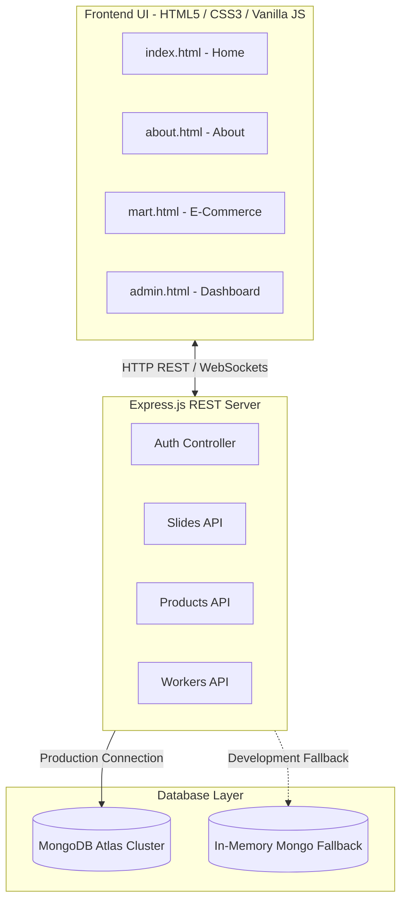

<!-- ═══════════════════════════════════════════════════════════════════ -->
<!--                          LIVSPACEONE                               -->
<!--            Premium Architecture & E-Commerce Ecosystem            -->
<!-- ═══════════════════════════════════════════════════════════════════ -->

<div align="center">
  <br />
  
  <br /><br />

  <h1>✨ LivspaceOne</h1>
  <p><strong>India's Next-Generation Luxury Architecture, Interior Design & LuxeBuild Materials Ecosystem</strong></p>

  <p>
    <a href="https://livspaceone.onrender.com" target="_blank">
      
    </a>
    
  </p>

  <p align="center">
    
    
    
    
    
  </p>
</div>

---

## 📖 Table of Contents
1. [🌟 About The Platform](#-about-the-platform)
2. [✨ High-End Features](#-high-end-features)
3. [🏗️ Architecture & Stack](#%EF%B8%8F-architecture--stack)
4. [🛠️ Local Installation & Development](#%EF%B8%8F-local-installation--development)
5. [📦 Database Architecture & Seeding](#-database-architecture--seeding)
6. [🌐 Render Deployment Guide](#-render-deployment-guide)
7. [💤 Render Sleep & Wake-up Guide (CRITICAL)](#-render-sleep--wake-up-guide-critical)
8. [🤝 Leadership Team](#-leadership-team)

---

## 🌟 About The Platform

**LivspaceOne** (formerly Majdoors) is an ultra-premium, high-contrast, light-mode architecture-tech ecosystem. It bridges the gap between discerning homeowners and elite, verified construction professionals (Architects, Master Plumbers, expert Electricians, and luxury Painters). 

In tandem, it provides a state-of-the-art e-commerce **LuxeBuild Mart** featuring premium, curated materials for structural construction and sophisticated interior finishes. Designed for visual excellence, micro-animations, and fluid speed, LivspaceOne is the ultimate all-in-one portal for high-end home creation.

---

## ✨ High-End Features

* 🛒 **LuxeBuild Marketplace**: A robust e-commerce catalog featuring high-grade items (Electrical, Plumbing, Paints, Flooring, Hardware, Construction) with seamless client-side cart management and checkouts.
* 👷 **Expert Services Directory**: Browse, filter, and schedule elite certified experts with dynamically updated availability and rating scores.
* 🌟 **Interactive Panoramic Slideshow**: A responsive, cinematic homepage banner featuring high-resolution architectural lightbox galleries that dynamically pull live records from the database.
* 🤖 **Smart Concierge Bot**: An instant-reply architectural support bot directly integrated on the frontend to handle site guidance, timing, locations, and booking inquiries.
* 🔒 **Admin Suite (CMS)**: Secure JWT-protected portal allowing operations teams to manage catalog inventories, update expert rosters, review contact submissions, and customize homepage hero slideshows.
* 🔄 **Real-Time Synchronicity**: Live worker availability toggles and booking alerts driven by a dynamic **Socket.io** web socket layer.

---

## 🏗️ Architecture & Stack

The platform utilizes a modern **Decoupled Architecture** built for clean separation of concerns:



### Stack Details:
* **Frontend**: HTML5, Vanilla ES6 Javascript, styling utilizing highly customized premium CSS Variables (vibrant accents, high-contrast minimalist cards, glassmorphism, responsive grid structures).
* **Backend**: Node.js & Express.js for the REST API layer, Socket.io for continuous bi-directional event emission.
* **Database**: Mongoose ODM with custom models for Users, Workers, Products, Categories, Slides, and Contact Messages.

---

## 🛠️ Local Installation & Development

### 1. Prerequisites
* **Node.js** (v18.0.0 or higher recommended)
* **npm** (v9.0.0 or higher)

### 2. Setup Files
Clone the repository and install all dependencies:
```bash
git clone https://github.com/harsh-raj00/livspaceone.git
cd livspaceone/backend
npm install
```

### 3. Environment Configuration
Create a `.env` file inside the `backend/` directory:
```env
PORT=3000
MONGO_URI=mongodb+srv://<username>:<password>@cluster.mongodb.net/livspaceone
JWT_SECRET=your_luxe_secure_jwt_key_2026
ALLOWED_ORIGINS=*
NODE_ENV=development
```

### 4. Running the Platform
Start the active Node server:
```bash
npm run dev
```
Once initialized, visit:
* 🌐 **Frontend Application**: `http://localhost:3000`
* 🛠️ **Backend API Endpoint**: `http://localhost:3000/api`

---

## 📦 Database Architecture & Seeding

LivspaceOne boasts an intelligent, zero-friction database setup:

* **Production (MongoDB Atlas)**: If a valid `MONGO_URI` is provided in `.env`, the server automatically connects to your cloud cluster. To seed your Atlas instance with premium datasets:
  ```bash
  node seed_atlas.js
  ```
* **Autonomous In-Memory Fallback**: If no MongoDB connection string is provided, or the network times out, the backend spins up an **In-Memory MongoDB Server** (`mongodb-memory-server`) automatically on boot! The database seeds itself in seconds, enabling immediate zero-configuration local development.

---

## 🌐 Render Deployment Guide

To deploy this full-stack application onto the Render cloud platform:

### 1. Create a Web Service
1. Sign in to your [Render Dashboard](https://dashboard.render.com).
2. Click **New +** and select **Web Service**.
3. Link your GitHub repository (`harsh-raj00/livspaceone`).

### 2. Configure Service Settings
* **Name**: `livspaceone`
* **Region**: Select your closest region (e.g., Singapore, Oregon)
* **Branch**: `main`
* **Root Directory**: `backend` (Crucial: The server lives in `/backend`, which hosts the static frontend)
* **Runtime**: `Node`
* **Build Command**: `npm install`
* **Start Command**: `node server.js`

### 3. Add Environment Variables
Add your key configurations in the **Environment** tab:
* `MONGO_URI` = *[Your Atlas Connection String]*
* `JWT_SECRET` = *[Your Secure JWT Key]*
* `NODE_ENV` = `production`

---

## 💤 Render Sleep & Wake-up Guide (CRITICAL)

> [!WARNING]
> **Why does the web app seem to hang or load very slowly when opening the live link?**
>
> Render's **Free Tier Web Services** automatically go to sleep after **15 minutes of zero active traffic**. 
> When a user visits the website after it has gone to sleep, Render initiates a **"Cold Start"**, booting up the instance from scratch. This process can take anywhere from **50 seconds to 2 minutes** before the page loads.

### 🌟 How to Wake It Up
If your app is currently asleep, visiting the live URL (e.g. `https://livspaceone.onrender.com`) will trigger Render's automated wake-up sequence. Leave the page open, and it will load fully in under 2 minutes.

### ⚡ 3 Ways to Prevent It from Sleeping
To keep your backend continuously warm and awake 24/7, choose one of these strategies:

#### Method A: Integrate an Automated Cron Ping Service (Highly Recommended & FREE)
Use a free monitoring tool like **[Cron-Job.org](https://cron-job.org/)** or **[UptimeRobot](https://uptimerobot.com/)**:
1. Register for a free account.
2. Create a new "Monitor" or "Cron Job".
3. Set the target URL to your backend health check: `https://your-app-name.onrender.com/api/categories`.
4. Configure the ping interval to run **every 12 to 14 minutes**.
5. *Result*: The constant ping ensures the server never encounters 15 minutes of inactivity, keeping your Free Tier instance awake permanently!

#### Method B: Self-Pinging Code Hook
Inside your `server.js`, you can inject an automated background worker that self-pings the server:
```javascript
setInterval(() => {
    const http = require('http');
    http.get('http://localhost:' + (process.env.PORT || 3000) + '/api/categories');
}, 12 * 60 * 1000); // Pings itself every 12 minutes
```
*(Note: If Render fully suspends the container, self-pinging won't fire. Thus, Method A is preferred).*

#### Method C: Upgrade to Render Starter Tier
If you are presenting to investors or launching for production, upgrade your Render Web Service to the **Starter** plan ($7/month). This completely disables sleeping and ensures 100% continuous uptime.

---

## 🤝 Leadership Team

Our high-performance leadership is modeled after Indian legendary visionaries:

* 🏏 **Sachin Tendulkar** — *Founder & CEO* (Vision and hyper-growth scaling)
* 📐 **Rohit Sharma** — *Chief Architect* (Master structural blue-printing)
* 🎨 **MS Dhoni** — *Head of Design* (Unrivaled, calm conceptual designs)
* ⚡ **Virat Kohli** — *VP of Operations* (Peak tactical coordination and speed)

---

<div align="center">
  <b>Designed with ❤️ by Harsh Raj</b>
</div>
