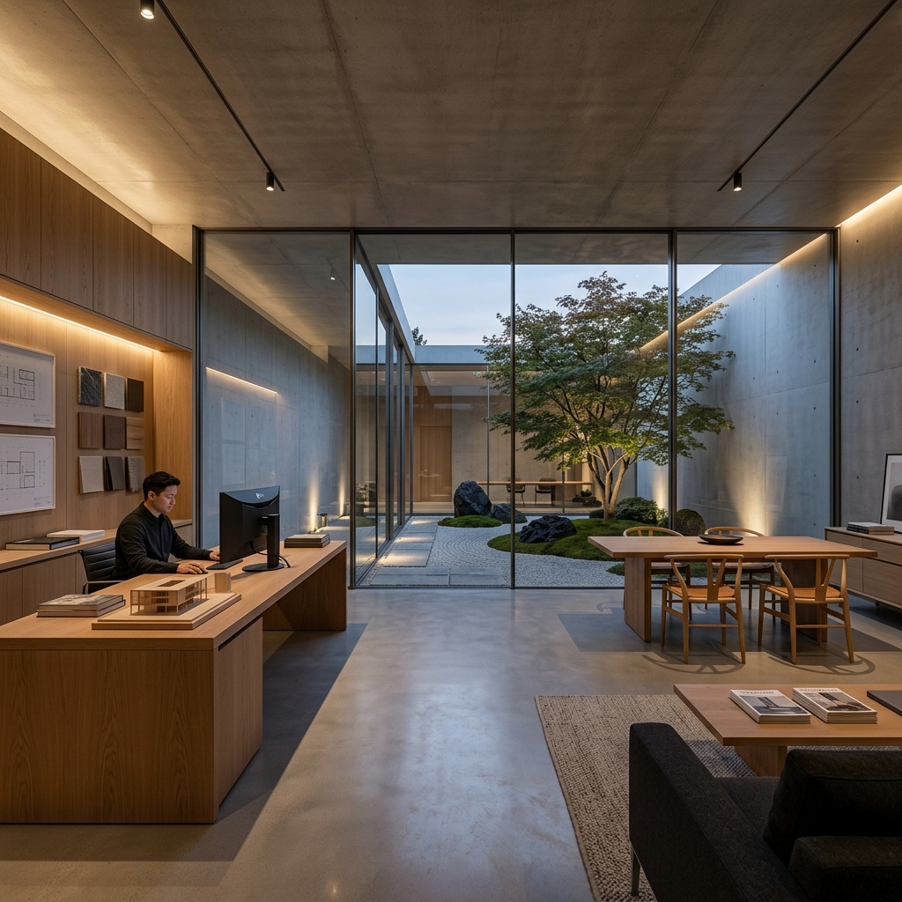
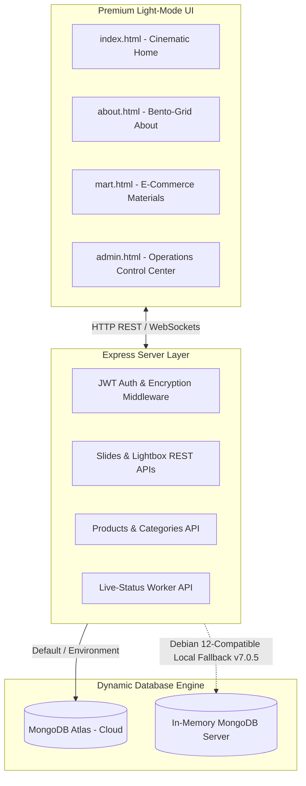

# ⚜️ LivspaceOne

<div align="center">
  
  <br /><br />

  <h3>📐 Next-Generation Luxury Architecture, Interior Design & LuxeBuild Materials Ecosystem</h3>
  <p><strong>India's premier digital storefront for sophisticated space creation and professional execution.</strong></p>

  <p>
    <a href="https://livspaceone.onrender.com" target="_blank">
      
    </a>
    
  </p>

  <p align="center">
    
    
    
    
    
  </p>
</div>

---

## 📖 Table of Contents
1. [🌟 Executive Overview](#-executive-overview)
2. [💎 Core Pillars & Features](#-core-pillars--features)
3. [🏗️ Technical Architecture](#%EF%B8%8F-technical-architecture)
4. [⚡ Getting Started (Local Development)](#-getting-started-local-development)
5. [📦 Database Management & Seeding](#-database-management--seeding)
6. [☁️ Render Cloud Deployment](#%EF%B8%8F-render-cloud-deployment)
7. [💤 Render Sleep & Wake-up Guide (CRITICAL)](#-render-sleep--wake-up-guide-critical)
8. [🤝 Leadership Team](#-leadership-team)

---

## 🌟 Executive Overview

**LivspaceOne** is an ultra-premium, high-contrast, light-mode architecture-tech platform designed to seamlessly connect luxury homeowners with India's elite certified contractors, architects, and design experts. 

Built with performance, responsiveness, and aesthetic minimalism in mind, LivspaceOne features a dual-system architecture:
* **The LuxeBuild Mart**: A highly tailored e-commerce interface for high-grade electrical, plumbing, painting, and construction materials.
* **The Design Studio**: A interactive workspace allowing clients to hire, schedule, and live-track elite service professionals.

---

## 💎 Core Pillars & Features

| Pillar | Features | Tech Stack |
| :--- | :--- | :--- |
| **LuxeBuild Mart** | Complete cart, checkout flow, structural material catalog, product filters | `MongoDB`, `Mongoose`, `Vanilla JS` |
| **Design Studio** | Verified professional profiles, direct scheduling, availability states | `Socket.io`, `Express API` |
| **Interactive UX** | Lightbox portfolio viewing, custom bento grid workflow panels, high-contrast aesthetics | `Custom CSS3`, `Vanilla JS` |
| **Operations (CMS)** | Full admin panel, active catalog updater, dynamically controllable sliders | `JWT Auth`, `Bcrypt`, `REST APIs` |
| **Smart Concierge** | Embedded intelligent support chatbot for immediate local and route queries | `Natural Language Regex` |

---

## 🏗️ Technical Architecture

LivspaceOne is engineered using a decoupled, highly responsive client-server model:



---

## ⚡ Getting Started (Local Development)

Follow these instructions to boot the local environment on your machine:

### 1. Repository Setup
```bash
git clone https://github.com/harsh-raj00/livspaceone.git
cd livspaceone/backend
npm install
```

### 2. Environment Variables Configuration
Create a `.env` file in the `backend/` directory:
```env
PORT=3000
MONGO_URI=mongodb+srv://<username>:<password>@cluster.mongodb.net/livspaceone
JWT_SECRET=livspaceone_secure_jwt_key_2026_production_x9k2m
ALLOWED_ORIGINS=*
NODE_ENV=development
```

### 3. Launch the Server
Start the local server instance:
```bash
node server.js
```
Visit the application at:
* 🌐 **Main Client**: `http://localhost:3000`
* 🛠️ **REST API Endpoints**: `http://localhost:3000/api`

---


## 🤝 Leadership Team For Fun

Our elite operations and engineering vectors are steered by legendary visionaries:

* 🏏 **Sachin Tendulkar** — *Founder & CEO* (Strategic scaling & leadership)
* 📐 **Rohit Sharma** — *Chief Architect* (Master structural planning)
* 🎨 **MS Dhoni** — *Head of Design* (Unrivaled, serene conceptual spaces)
* ⚡ **Virat Kohli** — *VP of Operations* (Peak execution, speed, & delivery)

---

<div align="center">
  <b>Designed with ❤️ by Harsh Raj</b>
</div>
